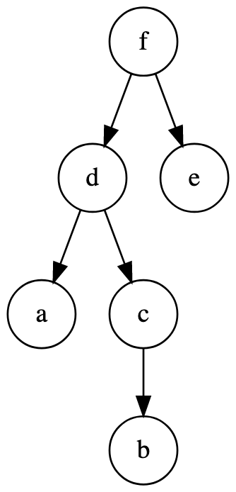
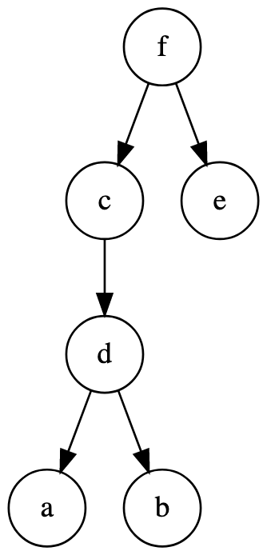

# CoDist

CoDist (Code Distance) is a library that provides functions to calculate the
edit distance and edit paths of abstract syntax trees.

While this library is primarily concerned with AST edit distances, it can handle
any generic tree of the form: `Tree[T] = tuple[T, tuple[Tree[T], ...]]`

## Install

```
pip install codist
```

## Usage

### Tree Edit Distance

Trees are represented as tuples: `Tree[T] = tuple[T, tuple[Tree[T], ...]]`.

For example, the following two trees from the original Zhang Shasha paper:

<div style="display: flex; gap: 0.5ch; justify-content: center;">


</div>

Can be represented with the following tuples:

```python
tree1 = ("f", (("d", (("a", ()), ("c", (("b", ()),)))), ("e", ())))
tree2 = ("f", (("c", (("d", (("a", ()), ("b", ())),),),), ("e", ())))
```

A small helper function, `t`, has been provided to make tree construction less
verbose:

```python
from codist import t

tree1 = t("f", t("d", t("a"), t("c", t("b"))), t("e"))
tree2 = t("f", t("c", t("d", t("a"), t("b"))), t("e"))
```

The distance between these two trees can be taken with the `tree_dist` function:

```python
from codist import tree_dist

dist = tree_dist(tree1, tree2)
print("The distance is:", dist)  # The distance is 2
```

A custom set of cost functions can be provided with a `Cost` object:

```python
from codist import Cost, tree_dist

cost = Cost(
    delete=lambda n: 3,
    insert=lambda n: 3,
    relabel=lambda n1, n2: 0 if n1 == n2 else 2,
)

dist = tree_dist(tree1, tree2, cost=cost)
print("The distance is:", dist)  # The distance is 6
```

By default, all change operations have a cost of 1 except for the case of
γ(a -> a) which is 0.

The edit path can be obtained with the `tree_edit` function which returns the
tree distance and a tuple of change operations:

```python
from codist import tree_edit

dist, path = tree_edit(tree1, tree2)
path = tuple(c for c in path if c[0] != c[1])
print("The distance is:", dist)  # The distance is 2
print("The changes are:", path)  # The changes are: (('c', 'Λ'), ('Λ', 'c'))
```

Change operations are 2-tuples of the form: `tuple[T | Lambda, T | Lambda]`
where `Lambda` is a singleton defined in the `distance` module.

The `tree_edit` function can also take a cost object.

### AST Edit Distance

Currently, only AST node _type_ information is compared. A silhouette of an AST
(an AST containing only type information) is constructed with
the `parse_ast_silhouette` function.

```python
from pprint import pprint
from codist.ast import parse_ast_silhouette

code1 = """
def process(data):
    result = []
    for x in data:
        if x > 5:
            result.append(x)
    return result
"""

code2 = """
def process(data):
    result = []
    for x in data:
        if x >= 6:
            result += [x]
    return result
"""

ast1 = parse_ast_silhouette(code1)
ast2 = parse_ast_silhouette(code2)

pprint(ast1)
pprint(ast2)
```

Which prints:

```
('Module',
 (('FunctionDef',
   (('arguments', (('arg', ()),)),
    ('Assign', (('Name', (('Store', ()),)), ('List', (('Load', ()),)))),
    ('For',
     (('Name', (('Store', ()),)),
      ('Name', (('Load', ()),)),
      ('If',
       (('Compare', (('Name', (('Load', ()),)), ('Gt', ()), ('Constant', ()))),
        ('Expr',
         (('Call',
           (('Attribute', (('Name', (('Load', ()),)), ('Load', ()))),
            ('Name', (('Load', ()),)))),)))))),
    ('Return', (('Name', (('Load', ()),)),)))),))
('Module',
 (('FunctionDef',
   (('arguments', (('arg', ()),)),
    ('Assign', (('Name', (('Store', ()),)), ('List', (('Load', ()),)))),
    ('For',
     (('Name', (('Store', ()),)),
      ('Name', (('Load', ()),)),
      ('If',
       (('Compare', (('Name', (('Load', ()),)), ('GtE', ()), ('Constant', ()))),
        ('AugAssign',
         (('Name', (('Store', ()),)),
          ('Add', ()),
          ('List', (('Name', (('Load', ()),)), ('Load', ()))))))))),
    ('Return', (('Name', (('Load', ()),)),)))),))
```

The distance between these ASTs can be taken as above.
